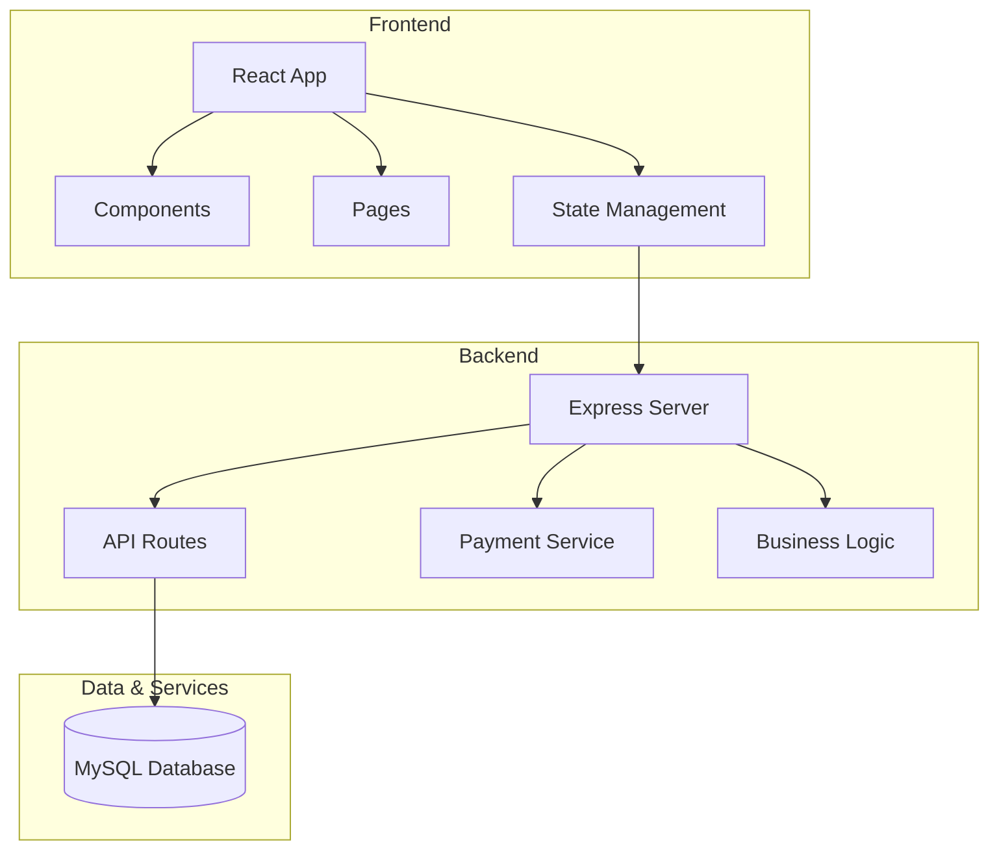
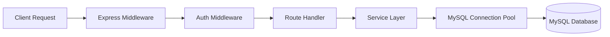
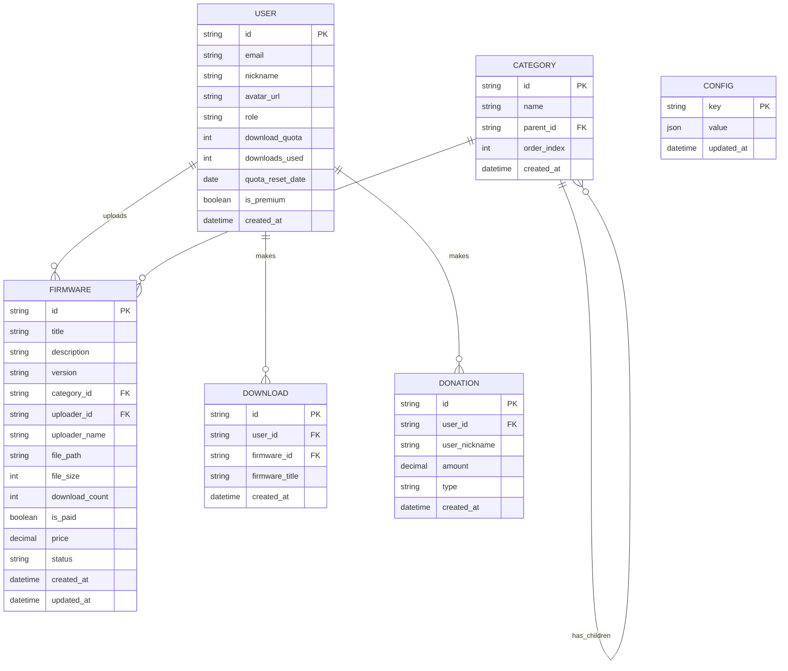

## 1. Architecture Design
采用 React + Express + MySQL 的全栈架构，前端负责用户界面和交互，后端处理业务逻辑和支付，MySQL 提供数据库服务。



## 2. Technology Description
- **Frontend**: React@18 + TypeScript + Vite + TailwindCSS + Framer Motion + Zustand
- **Backend**: Express@4 + TypeScript
- **Database**: MySQL 8.0+
- **Payment**: 集成第三方支付（模拟实现）
- **Initialization Tool**: vite-init with react-express-ts template

## 3. Route Definitions
| Route | Purpose |
|-------|---------|
| / | 首页 |
| /categories | 分类浏览 |
| /firmware/:id | 固件详情 |
| /login | 登录页面 |
| /register | 注册页面 |
| /user | 用户中心 |
| /upload | 固件上传（维护者） |
| /admin | 后台管理（管理员） |
| /payment/:type | 支付页面 |
| /api/* | 后端API路由 |

## 4. API Definitions

### 4.1 Type Definitions
```typescript
// 用户类型
interface User {
  id: string;
  email: string;
  nickname: string;
  avatar?: string;
  role: 'admin' | 'maintainer' | 'user';
  downloadQuota: number;
  downloadsUsed: number;
  quotaResetDate: Date;
  isPremium: boolean;
  createdAt: Date;
}

// 分类类型
interface Category {
  id: string;
  name: string;
  parentId?: string;
  orderIndex: number;
  children?: Category[];
  createdAt: Date;
}

// 固件类型
interface Firmware {
  id: string;
  title: string;
  description: string;
  version: string;
  categoryId: string;
  uploaderId: string;
  uploaderName?: string;
  filePath: string;
  fileSize: number;
  downloadCount: number;
  isPaid: boolean;
  price?: number;
  status: 'pending' | 'approved' | 'rejected';
  createdAt: Date;
  updatedAt: Date;
}

// 捐赠记录
interface Donation {
  id: string;
  userId?: string;
  userNickname: string;
  amount: number;
  type: 'single_download' | 'premium_upgrade';
  createdAt: Date;
}
```

### 4.2 API Endpoints
| Method | Path | Description |
|--------|------|-------------|
| GET | /api/categories | 获取分类树 |
| POST | /api/categories | 创建分类（管理员） |
| PUT | /api/categories/:id | 更新分类（管理员） |
| DELETE | /api/categories/:id | 删除分类（管理员） |
| GET | /api/firmware | 获取固件列表 |
| GET | /api/firmware/:id | 获取固件详情 |
| POST | /api/firmware | 上传固件（维护者） |
| POST | /api/firmware/:id/download | 下载固件 |
| GET | /api/user/profile | 获取用户资料 |
| PUT | /api/user/profile | 更新用户资料 |
| GET | /api/user/downloads | 获取下载记录 |
| POST | /api/payment/create | 创建支付订单 |
| GET | /api/payment/status/:id | 查询支付状态 |
| GET | /api/admin/users | 获取用户列表（管理员） |
| PUT | /api/admin/users/:id/role | 修改用户角色（管理员） |
| GET | /api/admin/donations | 获取捐赠记录 |
| GET | /api/admin/contributions | 获取贡献榜数据 |

## 5. Server Architecture Diagram


## 6. Data Model

### 6.1 Data Model Definition


### 6.2 Data Definition Language (MySQL)
```sql
-- 完整的 SQL 初始化脚本请查看项目根目录下的 init.sql
```

### 6.3 管理员账号信息
```
管理员邮箱: admin@example.com
管理员密码: admin123
```
