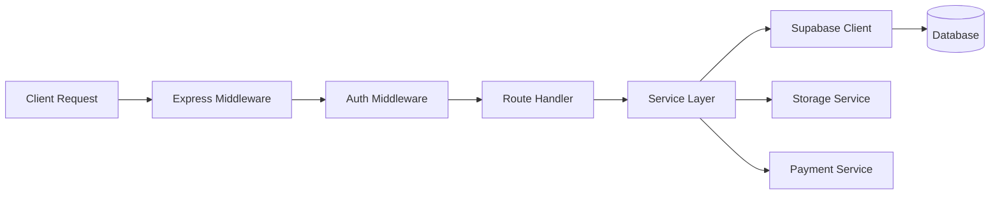
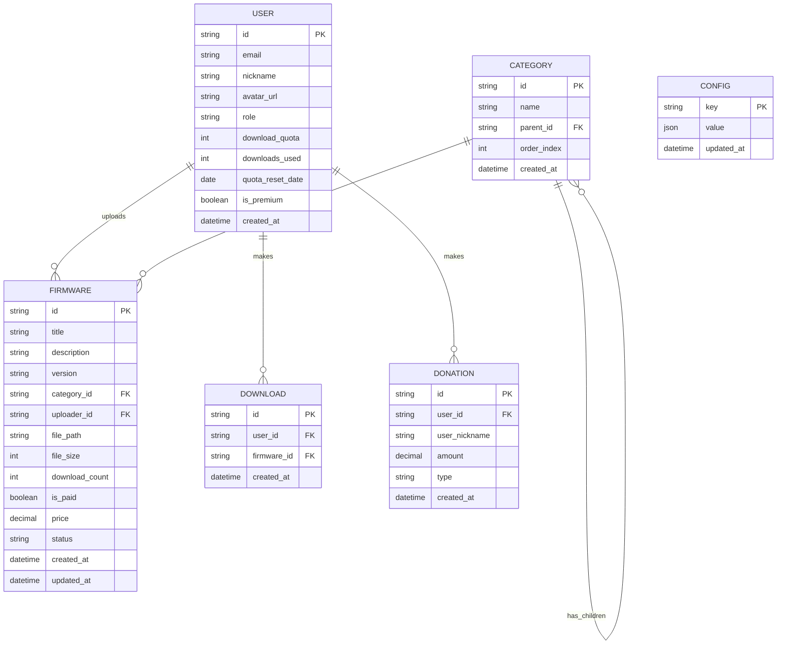

## 1. Architecture Design
采用 React + Express + Supabase 的全栈架构，前端负责用户界面和交互，后端处理业务逻辑和支付，Supabase 提供数据库、认证和存储服务。

```mermaid
graph TB
    subgraph "Frontend"
        A[React App]
        B[Components]
        C[Pages]
        D[State Management]
    end
    
    subgraph "Backend"
        E[Express Server]
        F[API Routes]
        G[Payment Service]
        H[Business Logic]
    end
    
    subgraph "Data & Services"
        I[(Supabase DB)]
        J[Supabase Auth]
        K[Supabase Storage]
    end
    
    A --&gt; B
    A --&gt; C
    A --&gt; D
    E --&gt; F
    E --&gt; G
    E --&gt; H
    D --&gt; E
    F --&gt; I
    F --&gt; J
    H --&gt; K
```

## 2. Technology Description
- **Frontend**: React@18 + TypeScript + Vite + TailwindCSS + Framer Motion + Zustand
- **Backend**: Express@4 + TypeScript
- **Database & Auth**: Supabase (PostgreSQL)
- **Payment**: 集成第三方支付（模拟实现）
- **Initialization Tool**: vite-init with react-express-ts template

## 3. Route Definitions
| Route | Purpose |
|-------|---------|
| / | 首页 |
| /categories | 分类浏览 |
| /firmware/:id | 固件详情 |
| /login | 登录页面 |
| /register | 注册页面 |
| /user | 用户中心 |
| /upload | 固件上传（维护者） |
| /admin | 后台管理（管理员） |
| /payment/:type | 支付页面 |
| /api/* | 后端API路由 |

## 4. API Definitions

### 4.1 Type Definitions
```typescript
// 用户类型
interface User {
  id: string;
  email: string;
  nickname: string;
  avatar?: string;
  role: 'admin' | 'maintainer' | 'user';
  downloadQuota: number;
  downloadsUsed: number;
  quotaResetDate: Date;
  isPremium: boolean;
  createdAt: Date;
}

// 分类类型
interface Category {
  id: string;
  name: string;
  parentId?: string;
  order: number;
  children?: Category[];
}

// 固件类型
interface Firmware {
  id: string;
  title: string;
  description: string;
  version: string;
  categoryId: string;
  uploaderId: string;
  fileSize: number;
  downloadCount: number;
  isPaid: boolean;
  price?: number;
  status: 'pending' | 'approved' | 'rejected';
  createdAt: Date;
  updatedAt: Date;
}

// 捐赠记录
interface Donation {
  id: string;
  userId: string;
  amount: number;
  type: 'single_download' | 'premium_upgrade';
  createdAt: Date;
}
```

### 4.2 API Endpoints
| Method | Path | Description |
|--------|------|-------------|
| GET | /api/categories | 获取分类树 |
| POST | /api/categories | 创建分类（管理员） |
| PUT | /api/categories/:id | 更新分类（管理员） |
| DELETE | /api/categories/:id | 删除分类（管理员） |
| GET | /api/firmware | 获取固件列表 |
| GET | /api/firmware/:id | 获取固件详情 |
| POST | /api/firmware | 上传固件（维护者） |
| POST | /api/firmware/:id/download | 下载固件 |
| GET | /api/user/profile | 获取用户资料 |
| PUT | /api/user/profile | 更新用户资料 |
| GET | /api/user/downloads | 获取下载记录 |
| POST | /api/payment/create | 创建支付订单 |
| GET | /api/payment/status/:id | 查询支付状态 |
| GET | /api/admin/users | 获取用户列表（管理员） |
| PUT | /api/admin/users/:id/role | 修改用户角色（管理员） |
| GET | /api/admin/donations | 获取捐赠记录 |
| GET | /api/admin/contributions | 获取贡献榜数据 |

## 5. Server Architecture Diagram


## 6. Data Model

### 6.1 Data Model Definition


### 6.2 Data Definition Language
```sql
-- 用户表
CREATE TABLE users (
    id UUID PRIMARY KEY DEFAULT gen_random_uuid(),
    email VARCHAR(255) UNIQUE NOT NULL,
    nickname VARCHAR(100) NOT NULL,
    avatar_url VARCHAR(500),
    role VARCHAR(20) DEFAULT 'user' CHECK (role IN ('admin', 'maintainer', 'user')),
    download_quota INTEGER DEFAULT 5,
    downloads_used INTEGER DEFAULT 0,
    quota_reset_date DATE,
    is_premium BOOLEAN DEFAULT FALSE,
    created_at TIMESTAMPTZ DEFAULT NOW()
);

-- 分类表
CREATE TABLE categories (
    id UUID PRIMARY KEY DEFAULT gen_random_uuid(),
    name VARCHAR(100) NOT NULL,
    parent_id UUID REFERENCES categories(id) ON DELETE CASCADE,
    order_index INTEGER DEFAULT 0,
    created_at TIMESTAMPTZ DEFAULT NOW()
);

-- 固件表
CREATE TABLE firmware (
    id UUID PRIMARY KEY DEFAULT gen_random_uuid(),
    title VARCHAR(200) NOT NULL,
    description TEXT,
    version VARCHAR(50),
    category_id UUID REFERENCES categories(id),
    uploader_id UUID REFERENCES users(id),
    file_path VARCHAR(500) NOT NULL,
    file_size BIGINT,
    download_count INTEGER DEFAULT 0,
    is_paid BOOLEAN DEFAULT FALSE,
    price DECIMAL(10, 2),
    status VARCHAR(20) DEFAULT 'pending' CHECK (status IN ('pending', 'approved', 'rejected')),
    created_at TIMESTAMPTZ DEFAULT NOW(),
    updated_at TIMESTAMPTZ DEFAULT NOW()
);

-- 下载记录表
CREATE TABLE downloads (
    id UUID PRIMARY KEY DEFAULT gen_random_uuid(),
    user_id UUID REFERENCES users(id),
    firmware_id UUID REFERENCES firmware(id),
    created_at TIMESTAMPTZ DEFAULT NOW()
);

-- 捐赠记录表
CREATE TABLE donations (
    id UUID PRIMARY KEY DEFAULT gen_random_uuid(),
    user_id UUID REFERENCES users(id),
    user_nickname VARCHAR(100) NOT NULL,
    amount DECIMAL(10, 2) NOT NULL,
    type VARCHAR(50) NOT NULL,
    created_at TIMESTAMPTZ DEFAULT NOW()
);

-- 系统配置表
CREATE TABLE config (
    key VARCHAR(100) PRIMARY KEY,
    value JSONB NOT NULL,
    updated_at TIMESTAMPTZ DEFAULT NOW()
);

-- 索引
CREATE INDEX idx_firmware_category ON firmware(category_id);
CREATE INDEX idx_firmware_uploader ON firmware(uploader_id);
CREATE INDEX idx_downloads_user ON downloads(user_id);
CREATE INDEX idx_donations_created ON donations(created_at DESC);
CREATE INDEX idx_categories_parent ON categories(parent_id);

-- RLS 策略
ALTER TABLE users ENABLE ROW LEVEL SECURITY;
ALTER TABLE categories ENABLE ROW LEVEL SECURITY;
ALTER TABLE firmware ENABLE ROW LEVEL SECURITY;
ALTER TABLE downloads ENABLE ROW LEVEL SECURITY;
ALTER TABLE donations ENABLE ROW LEVEL SECURITY;

-- 允许游客和用户读取分类
CREATE POLICY "Categories are viewable by everyone" ON categories
    FOR SELECT USING (true);

-- 允许游客和用户读取已审核的固件
CREATE POLICY "Approved firmware are viewable by everyone" ON firmware
    FOR SELECT USING (status = 'approved');

-- 初始数据
INSERT INTO config (key, value) VALUES
    ('site_settings', '{"name": "SSD开卡工具站", "description": "专业的固态硬盘开卡工具分享平台"}'),
    ('module_settings', '{"showHero": true, "showHot": true, "showLatest": true, "showDonations": true, "showContributors": true}'),
    ('quota_settings', '{"freeQuota": 5, "premiumQuota": 100, "singleDownloadPrice": 1, "premiumPrice": 8}');
```

### 6.3 Initial Data
```sql
-- 初始分类
INSERT INTO categories (name, parent_id, order_index) VALUES
    ('慧荣 (SMI)', NULL, 1),
    ('群联 (Phison)', NULL, 2),
    ('联芸 (Maxio)', NULL, 3),
    ('得一微 (YMC)', NULL, 4),
    ('SM2258XT', (SELECT id FROM categories WHERE name = '慧荣 (SMI)'), 1),
    ('SM2259XT', (SELECT id FROM categories WHERE name = '慧荣 (SMI)'), 2),
    ('PS3111', (SELECT id FROM categories WHERE name = '群联 (Phison)'), 1),
    ('PS5013', (SELECT id FROM categories WHERE name = '群联 (Phison)'), 2);
```
