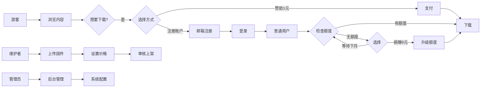

## 1. Product Overview
固态开卡工具下载站是一个专业的固态硬盘开卡工具分享平台，解决用户寻找、下载SSD开卡工具的需求，目标用户为电脑维修人员、DIY爱好者和硬件发烧友。
- 提供多层级分类的开卡工具浏览、下载服务
- 通过用户分级和赞助模式维持网站运营，建立可持续的发展生态

## 2. Core Features

### 2.1 User Roles
| Role | Registration Method | Core Permissions |
|------|---------------------|------------------|
| 管理员 | 后台创建 | 全功能管理，包括用户管理、分类管理、固件管理、系统配置 |
| 维护者 | 管理员邀请 | 上传固件、管理自有固件、售卖特殊固件 |
| 普通用户 | 邮箱注册 | 浏览内容、每月免费下载5个固件、捐赠升级额度 |
| 游客 | 无需注册 | 浏览所有内容，需赞助1元或注册后下载 |

### 2.2 Feature Module
1. **首页**: 英雄区、热门工具、最新上传、捐助公示、贡献榜
2. **分类浏览**: 多层级分类导航、固件列表、筛选搜索
3. **固件详情**: 工具信息、下载按钮、相关推荐
4. **用户中心**: 个人资料、下载记录、额度管理、捐赠记录
5. **上传管理**: 维护者上传固件、价格设置
6. **后台管理**: 用户管理、分类管理、固件审核、系统配置
7. **支付模块**: 1元单次下载、8元永久升级

### 2.3 Page Details
| Page Name | Module Name | Feature description |
|-----------|-------------|---------------------|
| 首页 | 英雄区 | 网站介绍、快速导航、统计数据展示 |
| 首页 | 热门工具 | 卡片式展示下载量最高的工具 |
| 首页 | 最新上传 | 时间线展示最近更新的固件 |
| 首页 | 捐助公示 | 滚动展示最近捐助的用户昵称 |
| 首页 | 贡献榜 | 排名展示维护者上传固件数量 |
| 分类浏览 | 分类导航 | 多层级树形分类，支持展开收起 |
| 分类浏览 | 固件列表 | 网格布局，支持筛选、排序、搜索 |
| 固件详情 | 信息展示 | 工具名称、版本、上传者、说明文档 |
| 固件详情 | 下载区 | 根据用户状态显示不同下载选项 |
| 用户中心 | 个人资料 | 头像、昵称、邮箱、角色展示 |
| 用户中心 | 额度管理 | 显示剩余下载次数、升级选项 |
| 上传管理 | 固件上传 | 表单填写、文件上传、价格设置 |
| 后台管理 | 分类管理 | 可视化拖拽调整分类层级 |
| 后台管理 | 系统配置 | 界面模块开关、参数调整 |

## 3. Core Process
游客访问网站 → 浏览固件详情 → 选择下载方式（1元赞助或注册登录）→ 完成支付或登录 → 下载固件
注册用户 → 登录 → 浏览固件 → 检查下载额度 → 免费下载或捐赠升级 → 下载固件
维护者 → 登录 → 进入上传管理 → 填写固件信息 → 上传文件 → 设置价格 → 提交审核 → 上架销售
管理员 → 登录后台 → 管理用户/分类/固件 → 调整系统配置 → 维护网站运营

## 4. User Interface Design
### 4.1 Design Style
- **主色调**: 深蓝色 (#1E3A8A) 搭配科技感蓝色渐变
- **辅助色**: 亮青色 (#06B6D4) 作为强调色，橙色 (#F97316) 用于警示/优惠
- **按钮风格**: 圆角矩形，带有微妙阴影和悬浮动效，主按钮使用渐变填充
- **字体**: 标题使用 Orbitron（科技感），正文使用 Inter（现代易读）
- **布局风格**: 卡片式布局，使用毛玻璃效果和微妙阴影增强层次感
- **图标风格**: 线性图标，配合霓虹边框效果，增强科技感

### 4.2 Page Design Overview
| Page Name | Module Name | UI Elements |
|-----------|-------------|-------------|
| 首页 | 英雄区 | 全屏渐变背景，大型标题打字机效果，3D SSD模型动画，粒子背景 |
| 首页 | 固件卡片 | 悬浮放大效果，边框发光动画，下载计数徽章 |
| 分类浏览 | 分类树 | 折叠展开动画，高亮当前选中，连接线视觉效果 |
| 用户中心 | 额度进度 | 环形进度条，动态数字变化，粒子填充效果 |
| 支付页面 | 支付选项 | 卡片翻转效果，价格标签浮动动画，扫码框脉冲效果 |
| 后台管理 | 配置面板 | 开关滑动动画，实时预览，拖拽排序 |

### 4.3 Responsiveness
- 桌面优先设计，流畅适配平板和手机端
- 断点：1280px（桌面）、768px（平板）、480px（手机）
- 移动端优化：汉堡菜单、单列布局、更大的点击区域、手势支持

### 4.4 Animation Details
- 页面加载：元素渐入 + 位移动画，使用 stagger 延迟创造层次感
- 滚动触发：元素进入视口时的淡入上移动画
- 交互反馈：按钮点击的缩放动效，卡片悬浮的抬升效果
- 状态切换：平滑过渡动画，加载状态的骨架屏
